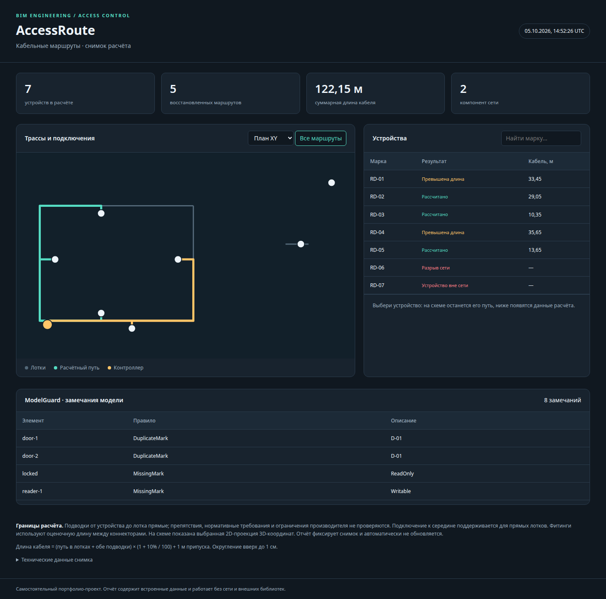
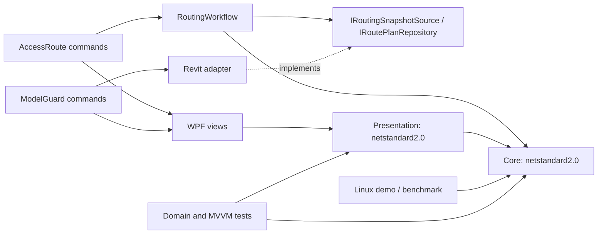

# ModelGuard — Revit 2021–2025

Проверка параметров BIM-модели по JSON-контрактам и безопасное заполнение марок оборудования.

Портфолио-проект на C#: .NET Framework 4.8 / .NET 8, Revit API, WPF/MVVM, ядро netstandard2.0. **Запуск внутри Revit ещё не проверен.** 68 тестов ядра и ViewModel; сборки пяти версий API проверены на Linux. Промышленного внедрения и официальной интеграции с Sigur нет.

[](https://github.com/lilter96/model-guard-revit/actions/workflows/ci.yml)



Скриншот показывает общий браузерный отчёт на синтетических данных, не интерфейс Revit.

В этом репозитории собирается и устанавливается только **ModelGuard**. Общие библиотеки, тесты и Linux-демо сохранены полностью. Второй плагин: [AccessRoute](https://github.com/lilter96/access-route-revit). Документы об общей архитектуре описывают оба проекта.

## ModelGuard

Проверка дверей и электрического/слаботочного оборудования текущего документа: марки, семейства, типы и контракт параметров.

- Версионированные JSON-профили: имя либо GUID shared parameter, Instance/Type/InstanceOrType, ожидаемый StorageType, обязательность, регулярное выражение, разрешённые значения и диапазоны integer.
- Имена категорий в правилах — стабильные BuiltInCategory, независимо от языка модели.
- Различаются отсутствие, пустое значение, неоднозначность имени и неправильный уровень хранения параметра.
- Проверка ссылок на оборудование по марке: не найдено либо найдено несколько целей.
- Regex ограничены таймаутом. Double-диапазоны намеренно не интерпретируются без явного контракта единиц.
- Предпросмотр заполнения только пустых доступных марок; нумерация учитывает весь документ. Повторное заполнение идемпотентно.
- Проверка worksharing ownership до записи, ручные транзакции, отказ/откат при ошибках. Ошибки отдельного действия не откатывают ранее успешно выполненные действия команды.

Пример контракта: [samples/acs-profile.json](samples/acs-profile.json). Это пример проектных требований, а не спецификация производителя. Связи RVT и IFC не проверяются.

## Архитектура



Ядро и ViewModel не зависят от Autodesk/WPF. Revit API вызывается на потоке Revit внутри `IExternalCommand`; модальные окна возвращают намерение пользователя и не обращаются к Document. DI — через конструкторы и узкие порты. Пять сборок: net48 для 2021–2024, net8.0-windows для 2025. Ru/en `.resx` в Presentation. [Обоснование решений](docs/ARCHITECTURE.md), [ADR](docs/DECISIONS.md).

## Проверить на Linux

Нужны SDK и runtime .NET 8. Скрипт использует локальный SDK из `.tools/dotnet`, если он установлен, иначе `dotnet` из PATH:

```bash
./scripts/demo.sh
```

Открыть `demo-output/AccessRoute.html` либо готовый [examples/AccessRoute.html](examples/AccessRoute.html) в браузере. JSON-снимки синтетические; демо не выполняет Revit API. Сохраняются маршруты, CSV, предпросмотр марок, схема в JSON и HTML.

Замер на этой машине: 7 080 сегментов, 1 500 запросов ближайшего участка — индекс 4.85 мс против полного перебора 68.41 мс; 500 устройств рассчитаны за 115 мс. Время ядра, **без чтения и записи Revit**. Методика и первичный JSON: [docs/evidence/benchmark.json](docs/evidence/benchmark.json).

```bash
dotnet run --project tools/BimPortfolio.Demo -c Release -- --benchmark artifacts/benchmark.json
```

Браузерные проверки отдельно, Node 22 + Playwright:

```bash
npm ci --prefix scripts/browser
scripts/browser/node_modules/.bin/playwright install chromium
PORTFOLIO_PLAYWRIGHT_MODULE="$PWD/scripts/browser/node_modules/playwright" node scripts/verify-report.cjs
```

## Собрать и установить на Windows

Закрыть Revit; установить .NET SDK 8. Готовый комплект содержит сборки всех версий, поэтому для его установки пересборка не нужна.

```powershell
dotnet build BimPortfolio.sln -c Release -p:RevitVersion=2025
powershell -ExecutionPolicy Bypass -File scripts/Install.ps1 -RevitVersion 2025
```

Для всех версий: `powershell -File scripts/Build-All.ps1`. `.addin` — в `%APPDATA%/Autodesk/Revit/Addins/<year>`, DLL — в `%LOCALAPPDATA%/BimPortfolio/<year>`. Панель ModelGuard на вкладке Add-Ins. [Первый запуск](docs/GETTING-STARTED.md), [обязательная приёмка внутри Revit](docs/REVIT-ACCEPTANCE.md).

API NuGet Nice3point используется только для компиляции; это сторонняя упаковка Autodesk API. DLL Revit не поставляются. Можно использовать официальный установленный API:

```powershell
dotnet build BimPortfolio.sln -c Release -p:RevitVersion=2025 '-p:RevitApiDir=C:\Program Files\Autodesk\Revit 2025'
```

Конкретные обновления Revit, особенно с другим .NET runtime, требуют отдельной проверки. Подпись сборок, MSI и обфускация не реализованы. Удалить манифесты, сохранив данные: `powershell -File scripts/Uninstall.ps1 -RevitVersion 2025`.

## Поставка и интервью

`python3 scripts/package.py` создаёт `artifacts/model-guard-revit.zip`: исходники, примеры, документация и ModelGuard для пяти выпусков. Комплект проверяется на зависимости, отсутствие API DLL и целостность ZIP. GitHub Actions запускает тесты, браузерные проверки и Windows-матрицу при каждом push; текущий результат виден в badge выше.

[Как объяснять проекты на интервью](docs/INTERVIEW.md). Для заявления «используется проектировщиками» нужен реальный пилот и подтверждённая приёмка, а не число технологий в репозитории.
